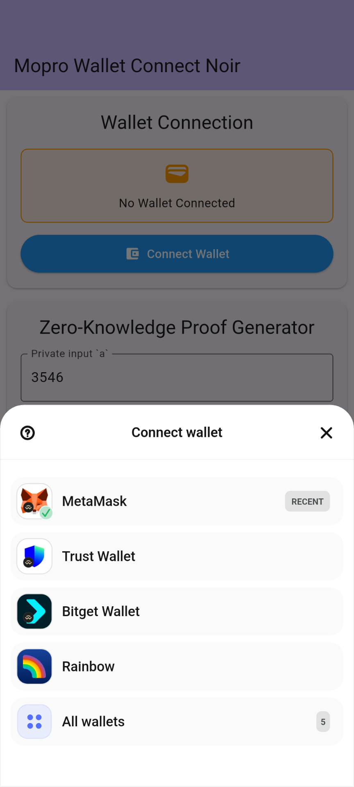
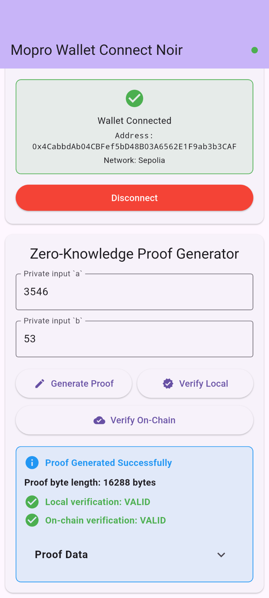

# 📱 Mopro Wallet Connect Noir

> **Zero-Knowledge Proofs on Mobile with Noir + Solidity Verification**

[](https://noir-lang.org/)
[](https://flutter.dev/)

A Flutter template created by [Mopro CLI](https://github.com/zkmopro/mopro/tree/main/cli) that enables Noir proof generation with barretenberg bakcend, supporting **on-chain verification** through Solidity smart contracts.

## 📸 App Demo

<div align="center">

| Wallet Connect Integration | On-Chain Verification |
|:-------------------------:|:---------------------:|
|  |  |
| *Connect to 300+ wallets using Reown AppKit with deeplink* | *Generate Noir proofs on mobile and verify them on chain* |

</div>

## 🚀 Quick Start

### Prerequisites

Before you begin, ensure you have:

- **Flutter SDK** (>= 3.3.4): [Install Flutter](https://docs.flutter.dev/get-started/install)
- **Rust toolchain** (1.89.0) : [Install Rust](https://rustup.rs/)
- **Noir** (1.0.0-beta.8): 
  ```bash
  noirup --version 1.0.0-beta.8
  ```
- **Barretenberg** (1.0.0-nightly.20250723):
  ```bash
  bbup -v 1.0.0-nightly.20250723
  ```
- **Reown Appkit's Project ID**: [Get yours at cloud.reown.com](https://cloud.reown.com)

### 1. Clone & Setup

```bash
# Clone the repository
git clone https://github.com/your-username/mopro-wallet-connect-noir
cd mopro-wallet-connect-noir

# Generate Flutter Bindings
# Select `Flutter` Options 
mopro build

# Install Flutter dependencies
cd flutter
flutter pub get
```

### 2. Configure Wallet Connect

```bash
# Run with your Reown Appkit's Project ID
flutter run --dart-define=PROJECT_ID=your_project_id_here
```

### 3. Test the Demo Circuit

The app comes with a simple multiplication circuit that proves `a * b = result` without revealing `a` and `b`:

1. Launch the app on your device/simulator
2. Connect your wallet (MetaMask, Trust, etc.)
3. Enter private inputs (e.g., a=3, b=5)
4. Generate proof → Verify locally → Verify on-chain

**That's it!** You've just generated and verified your first mobile ZK proof with Mopro and Noir!

## 🛠️ Customizing Your App with Mopro

This repository shows the power of the **Mopro** for creating cross-platform ZK applications. Here's how how you can build similar apps:

#### 1. **Add Your Circuit**
Place your Noir circuit in `circuits/src/main.nr`:
```rust
fn main(your_private_input: Field, your_public_input: pub Field) {
    // Your circuit logic here
    assert(your_private_input * 2 == your_public_input);
}
```

#### 2. **Extend Rust Library**
Add custom functions to `src/lib.rs`:
```rust
#[uniffi::export]
fn your_custom_function(input: String) -> String {
    // Your custom logic
    format!("Processed: {}", input)
}
```

#### 3. **Rebuild Bindings**
```bash
# Regenerate native bindings after Rust changes
mopro build

# Update bindings to Flutter
mopro update
```

#### 4. **Update Flutter Integration**
The generated Flutter plugin automatically includes your new functions:
```dart
// Auto-generated in mopro_flutter_plugin
final result = await MoproFlutter().yourCustomFunction("test");
```

## 🔧 Detailed Setup

### Noir Circuit

#### Understanding the Example Circuit

```rust
// circuits/src/main.nr
fn main(a: Field, b: Field, result: pub Field) {
    assert(a * b == result);
}
```

This circuit:
- Takes two **private inputs** `a` and `b`
- Takes one **public input** `result`
- Proves that `a * b = result` without revealing `a` or `b`

#### Compiling Your Circuit

```bash
cd circuits

# Compile the circuit
nargo compile

# Generate witness and bytecode
nargo execute

# Check the output
ls target/
# circuits.json - Compiled circuit bytecode
```

### Proof Generation & Verification

#### Generate Proofs with Barretenberg

```bash
# Generate proof with verification key
bb prove --write_vk \
  -b ./target/circuits.json \
  -w ./target/circuits.gz \
  -o ./target \
  --oracle_hash keccak \
  --output_format bytes_and_fields

# Verify proof locally  
bb verify \
  -k ./target/noir_multiplier2.vk \
  -p ./target/proof \
  --oracle_hash keccak
```

#### Generate Solidity Verifier

```bash
# Create Solidity verifier contract
bb write_solidity_verifier \
  -k ./target/noir_multiplier2.vk \
  -o ./target/Verifier.sol
```

### Smart Contract Deployment

#### Deploy Your Verifier

1. **Deploy the Verifier Contract**:
   ```solidity
   // The generated Verifier.sol contains a verify() function
   function verify(bytes calldata proof, bytes32[] calldata publicInputs) 
       external view returns (bool)
   ```

2. **Update Mobile App Configuration**:
   ```dart
   // flutter/lib/main.dart
   static const String contractAddress = "0xYourContractAddress";
   static const String contractABI = '''[your_contract_abi]''';
   ```

#### Testnet Integration

The demo is configured for **Sepolia testnet**:
- Contract: [`0x3C9f0361F4120D236F752035D22D1e850EA0f5E6`](https://sepolia.etherscan.io/address/0x3C9f0361F4120D236F752035D22D1e850EA0f5E6)
- RPC: `https://ethereum-sepolia.publicnode.com`

## 🔄 Customizing Your Circuit

### 1. Modify the Noir Circuit

Edit `circuits/src/main.nr` for your use case:

```rust
// Example: Age verification circuit
fn main(birth_year: Field, current_year: pub Field, min_age: pub Field) {
    let age = current_year - birth_year;
    assert(age >= min_age);
}
```

### 2. Update Circuit Inputs

Run `nargo check` to generate `Prover.toml` accordingly.

Modify `circuits/Prover.toml`:
```toml
birth_year = "1990"
current_year = "2024"  
min_age = "18"
```

### 3. Rebuild Circuit Assets

```bash
cd circuits
nargo execute

# Generate new proof artifacts
bb prove --write_vk -b ./target/circuits.json -w ./target/circuits.gz -o ./target --oracle_hash keccak --output_format bytes_and_fields

# Generate new Solidity verifier
bb write_solidity_verifier -k ./target/circuits.vk -o ./target/Verifier.sol
```

### 4. Update Flutter App

```dart
// Update input fields in flutter/lib/main.dart
TextFormField(
  controller: _controllerBirthYear,
  decoration: const InputDecoration(
    labelText: "Birth Year",
    hintText: "For example, 1990",
  ),
),
```

## 📱 Mobile App Architecture

### Project Structure

```
flutter/
├── lib/
│   ├── main.dart              # Main app & proof UI
│   ├── wallet_connect_service.dart  # Wallet integration
│   └── config.dart            # App configuration
├── mopro_flutter_plugin/      # Native Rust bindings
│   ├── lib/mopro_flutter.dart # Flutter API
│   ├── ios/                   # iOS native code
│   └── android/               # Android native code
└── assets/                    # Circuit artifacts
    ├── noir_multiplier2.json
    ├── noir_multiplier2.srs
    └── noir_multiplier2.vk
```

### Key Components

#### Proof Generation Flow
```dart
// Generate proof on mobile
final proof = await _moproFlutterPlugin.generateNoirKeccakProofWithVk(
  "assets/noir_multiplier2.json",  // Circuit
  "assets/noir_multiplier2.srs",   // Trusted setup
  verificationKey,                 // VK bytes
  ["3", "5"],                     // Private inputs
  disableZk: false,
  lowMemoryMode: false
);
```

#### Wallet Integration
```dart
// Connect wallet
await WalletConnectService.initialize(context);
await WalletConnectService.connect();

// Verify on-chain
final verified = await contract.call(
  function: verifyFunction,
  params: [proof, publicInputs]
);
```

## 📚 Resources

### Documentation
- [Noir Language Guide](https://noir-lang.org/docs)
- [Barretenberg Documentation](https://github.com/AztecProtocol/barretenberg)
- [Mopro Documentation](https://zkmopro.org/docs)
- [zkmopro/noir-rs](https://github.com/zkmopro/noir-rs)
- [Flutter Development](https://docs.flutter.dev/)

### Community

Ready to build privacy-preserving mobile applications? [Join our community on Telegram](https://t.me/zkmopro) for support!
